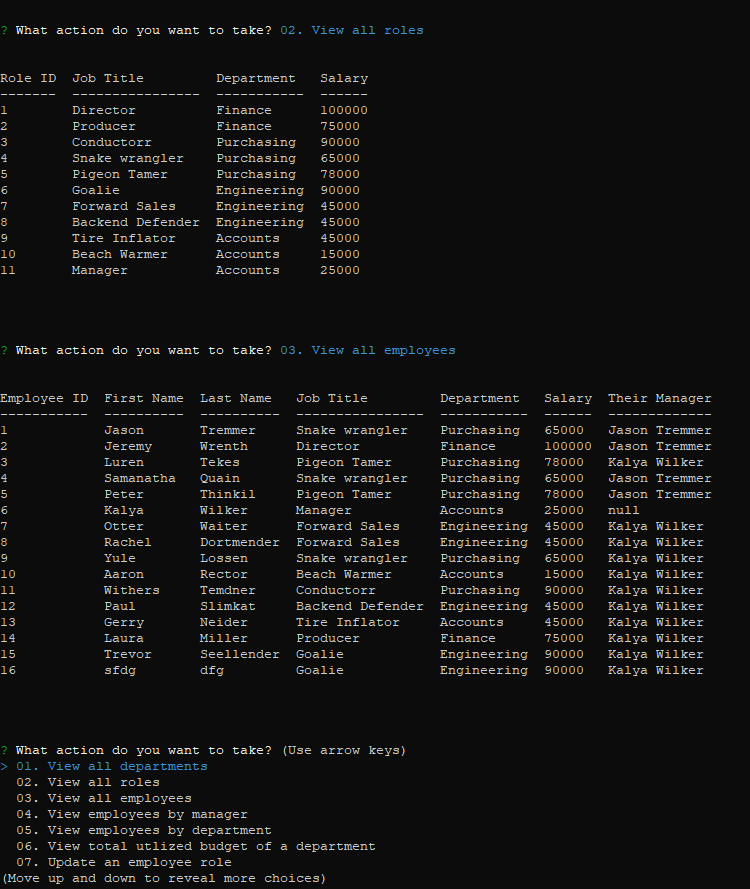

# Employee_Tracker
CLI to ineract with database of employees the company

## Description

Ths is a command line application for the task f tracking who orks where and who do they report to. This will present the user with a list and ask for a action to to do or query to make. Depending on the 

## Usage

This is a command line interface so the keyboard will be the input tool. The user will need to use the up and down arrows as well as the alphanumeric keys to enter simple information.

## License

MIT

## Screen Shots

